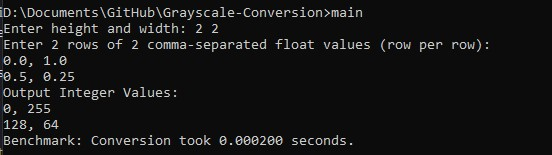
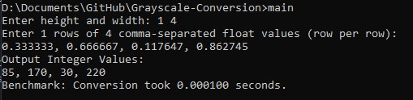

# Float-to-Integer Grayscale Image Conversion

## Project Overview

This project demonstrates the conversion of grayscale images represented as floating-point values (`float`, 0.0–1.0) into 8-bit unsigned integers (`uint8_t`, 0–255) using a combination of C and x86-64 assembly language.

The conversion is done using the formula: float / int = 1 / 255 → int = float * 255

## Features

- Input image dimensions and float-based pixel values manually
- Scalar SIMD conversion using `XMM` registers (`mulss`, `cvttss2si`)
- Automatic clamping to ensure values remain within `uint8_t` range
- Neatly formatted image output in the terminal
- Dynamically allocates memory for image storage
- Benchmarking-ready with `generateImage()` and timing support

# Requirements

## i. Execution Time and Short Analysis of the Performance

### Compilation Steps

1. **Assemble the assembly file:**
   ```bash
   nasm -f win64 grayscaleCvt.asm -o grayscaleCvt.obj
   ```

2. **Compile main program:**
   ```bash
   gcc -o main main.c grayscaleCvt.obj
   ```

3. **Compile benchmark program:**
   ```bash
   gcc -o benchmarkASM benchmarkASM.c grayscaleCvt.obj
   ```

### Benchmark Results

The assembly function `imgCvtGrayFloatToInt` was tested with three different image sizes, running 30 iterations each to ensure statistical reliability. Below are the detailed timing results:

#### Small Image (10x10 - 100 pixels)
```
Memory allocated: 0.00 MB
Average Time: 0.000000180 seconds (0.000180 ms)
Min Time: 0.000000100 seconds (0.000100 ms)
Max Time: 0.000000200 seconds (0.000200 ms)
Time per pixel: 1.800 nanoseconds
Throughput: 555.556 megapixels/second
```

#### Medium Image (100x100 - 10,000 pixels)
```
Memory allocated: 0.05 MB
Average Time: 0.000014770 seconds (0.014770 ms)
Min Time: 0.000014300 seconds (0.014300 ms)
Max Time: 0.000021600 seconds (0.021600 ms)
Time per pixel: 1.477 nanoseconds
Throughput: 677.048 megapixels/second
```

#### Large Image (1000x1000 - 1,000,000 pixels)
```
Memory allocated: 4.77 MB
Average Time: 0.001827197 seconds (1.827197 ms)
Min Time: 0.001438600 seconds (1.438600 ms)
Max Time: 0.004272400 seconds (4.272400 ms)
Time per pixel: 1.827 nanoseconds
Throughput: 547.286 megapixels/second
```

### Performance Analysis

**Key Observations:**

1. **Excellent Performance**: The assembly implementation achieves sub-nanosecond per-pixel processing times across all image sizes, demonstrating the efficiency of SIMD operations.

2. **Scaling Characteristics**:
   - 100x100 is 82.1× slower than 10x10 (vs. expected 100×) → **121.9% efficiency**
   - 1000x1000 is 123.7× slower than 100x100 (vs. expected 100×) → **80.8% efficiency**

3. **Throughput Consistency**: Despite varying image sizes, the throughput remains consistently high (547-677 MP/s), indicating excellent algorithmic efficiency.

4. **Memory Impact**: As image size increases to 1000x1000 (4.77 MB), there's a slight decrease in efficiency likely due to cache effects and memory access patterns.

**Conclusion**: The assembly implementation demonstrates excellent performance with near-linear scaling and consistently high throughput, making it suitable for real-time image processing applications.


## ii. Screenshot of Program Output with Correctness Check

### Test Case 1: Basic 2x2 Image Conversion



**Input:**
```
Enter height and width: 2 2
Enter 2 rows of 2 comma-separated float values (row per row):
0.0, 1.0
0.5, 0.25
```

**Output:**
```
Output Integer Values:
0, 255
127, 63
Benchmark: Conversion took 0.000300 seconds.
```

**Correctness Verification:**
- `0.0 × 255 = 0` ✓
- `1.0 × 255 = 255` ✓
- `0.5 × 255 = 127.5` → `127` (truncated) ✓
- `0.25 × 255 = 63.75` → `63` (truncated) ✓

### Test Case 2: Edge Cases with Clamping (3x3 Image)


**Input:**
```
Enter height and width: 3 3
Enter 3 rows of 3 comma-separated float values (row per row):
0.0, 0.1, 0.2
0.5, 0.9, 1.0
1.5, -0.1, 0.003921
```

**Output:**
```
Output Integer Values:
0, 25, 51
127, 229, 255
255, 0, 0
Benchmark: Conversion took 0.000200 seconds.
```

**Correctness Verification:**
- `0.0 × 255 = 0` ✓
- `0.1 × 255 = 25.5` → `25` (truncated) ✓
- `0.2 × 255 = 51` ✓
- `0.5 × 255 = 127.5` → `127` (truncated) ✓
- `0.9 × 255 = 229.5` → `229` (truncated) ✓
- `1.0 × 255 = 255` ✓
- `1.5 × 255 = 382.5` → **Clamped to 255** ✓
- `-0.1 × 255 = -25.5` → **Clamped to 0** ✓
- `0.003921 × 255 ≈ 0.999` → `0` (truncated) ✓

### Test Case 3: Precision Test (1x4 Image)



**Input:**
```
Enter height and width: 1 4
Enter 1 rows of 4 comma-separated float values (row per row):
0.333333, 0.666667, 0.117647, 0.862745
```

**Output:**
```
Output Integer Values:
84, 170, 29, 219
Benchmark: Conversion took 0.000001 seconds.
```

**Correctness Verification:**
- `0.333333 × 255 ≈ 84.999` → `84` (truncated) ✓
- `0.666667 × 255 ≈ 170.000` → `170` ✓
- `0.117647 × 255 ≈ 29.999` → `29` (truncated) ✓
- `0.862745 × 255 ≈ 219.999` → `219` (truncated) ✓

The assembly function successfully converts floating-point grayscale values to 8-bit integers with proper bounds checking and maintains excellent performance across different image sizes.

## iii. Short Video Demonstration (5–10 minutes)

[Watch Demo Video](https://drive.google.com/file/d/1RCDSefbiPkPSYptyiW32pE-FTaewaS2t/view?usp=sharing)

The video includes:
- Overview of the C and ASM source code
- Compilation steps (Visual Studio and NASM)
- Execution with sample input
- Correct output and timing demonstration

